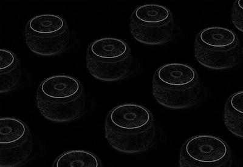

# go-carve

https://user-images.githubusercontent.com/32017929/179416668-179eb0e4-2520-4ed2-9451-cda44a4ccbb9.mp4

Resize images using seam carving. [Try it out!](https://sam4815.github.io/go-carve)

## About

This project was intended to explore and understand in greater detail [seam carving](https://en.wikipedia.org/wiki/Seam_carving), a really interesting algorithm used to resize images. My aim was to implement this algorithm without the help of any image processing or matrix manipulation libraries, with the hope of better understanding the underlying logic. I was also interested in trying out WebAssembly with Go, having recently worked with Emscripten.

### Algorithm overview

Seam carving attempts to identify objects in an image and cut out paths of pixels that avoid the objects. The algorithm can be divided into two parts: calculating where the objects are located, and then deleting the least important pixel paths across the image.

Object identification is accomplished by detecting all of the edges in an image. An edge can be thought of as a sharp change in colour between two adjacent pixels. To calculate that change, we can travel along each pixel and compare it to its neighbours.

For simplicity, instead of comparing the RGB values between each pixel, we can convert the image to grayscale so that each pixel is reduced to a single value: the intensity of light at that pixel. Then we only need to look at that value when comparing neighbours.

For a single line of pixels, $[x[i-1], x[i], x[i+1]]$, we can multiply it element-wise by the matrix $[-0.5, 0, 0.5]$ and take its sum to give the derivative of $x$ in the "right"-direction (i.e. the vertical edges). Transposing this matrix will allow us to calculate the horizontal edges. These matrices are known as the [Sobel operator](https://en.wikipedia.org/wiki/Sobel_operator).

Using the 2-dimensional Sobel operator, we can move across each pixel and calculate the magnitude of its gradient. Using the image shown in the demo above, the edges can be visualized as so:

Now we just need to calculate a path from the top of the image to the bottom of the image that avoids as many edges as possible. We can begin by defining the cost of any single pixel as the minimum cost path from that pixel to the bottom of the image. So the bottom row of pixels is simply equal to their current gradient value, and then the cost of each pixel in the above row is equal to its current gradient value _plus_ the cheapest pixel of the 3 directly beneath it. This results in the following visualization:

Observe the costliest pixels (i.e. the brightest pixels) are those that begin above an object. At those pixels, there is no way of descending to the bottom of the image without passing through an edge.

The final part of this algorithm is to simply pick the cheapest pixel in the top row and descend by picking the cheapest pixel directly beneath it. For this image, we find the following path:

We remove the path and continue calculating and removing the cheapest paths until the image is the desired width. For removing horizontal paths, we can just rotate the image by 90 degrees and perform the same path-finding algorithm.

### Performance

I was unsure whether the result would be reasonably performant because I couldn't find any vanilla Go implementations - most of the examples I found online were written in Python and relied on libraries like NumPy to speed up matrix manipulation. I was also doubtful WASM/Go would speed things up compared to JS given current browser benchmarks (I picked WebAssembly purely to experiment with Go, not for performance).

My initial implementation was painfully slow, and I found that the main bottleneck was interacting with Go's image library. Calls to `Set` and `At` were unnecessarily costly, and the `Image` interface contains a lot of information I don't need, so I switched my representation of pixels to plain Go slices (encapsulated by the custom `matrix` struct defined at the top of `main.go`). This sped things up considerably, but I was still spending a lot of time initializing new slices, so I modified functions like `calculateCostPaths` and `removeSeam` to mutate the slices in-place and this further improved performance to the point where I was satisfied with it.

One issue I ran into when attempting to implement a loading/in-progress state is that the Go/WASM code was blocking the UI thread whilst it was running. So although Go would call code to update the DOM with an in-progress representation of the image (i.e. with only a few seams removed), the DOM would only update once all seams were removed, preventing the user from seeing any intermediate steps. I fixed this by moving the WASM code to a Web Worker defined in [worker.js](web/worker.js). Now, the Go code calls the worker to update the DOM, the worker passes the message to the main UI thread, and the DOM is able to update whilst the Go code is still executing, thereby enabling the user to see seams being removed in real-time.

Note that the seam removal process would be much faster if not for the costly transfer between WASM/JS of the in-progress image every 3 seams. I opted to keep it this frequent because I liked the visual effect of seeing the image progressively transform, but if we reduced the number of updates to, say, every 100 seams, the algorithm would complete much faster because copying huge chunks of data from WASM to JS is one of the most costly operations possible when working with WebAssembly.
